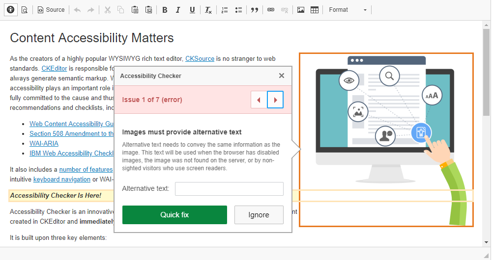

<a href="https://doc.jahiacommunity.org">
    
</a>

CKEditor WCAG extension - <a href="README.md">Version française</a>
======================
The internet is an essential way to access and provide information and services. Web accessibility allows everyone, including people with disabilities, to perceive, understand, navigate and interact with the Internet. The same vision of accessibility needs to apply to mobile applications, considering the developments in technology and trends in the last years. 

## The Web Accessibility Directive
<a href="https://eur-lex.europa.eu/eli/dir/2016/2102/oj">Directive (EU) 2016/2102</a>, in force since 22 December 2016, will provide people with disabilities with better access to the websites and mobile apps of public services.

## CMS Content Edition
During edition of content, contributors are not focused on accessibility. To help users to apply to european directive, a CKEditor plugin can contribute to this achievement. <a href="https://ckeditor.com/ckeditor-4/accessibility-checker/">Accessibility Checker</a> provide multiple rules to control content compliance to web accessibility. In some case, a quick fix is available.

To configure a plugin in edit mode we must provide a ***config.js*** file. This configuration file will contain a list of plugins to activate and position of new icons in toolbars.

```javascript
CKEDITOR.editorConfig = function( config ) {
    config.extraPlugins='a11ychecker';
    config.toolbar_Full[8]=['Image','Flash','Table','HorizontalRule','Smiley','SpecialChar','PageBreak','A11ychecker'];
}
```
- *config.extraPlugins* = List of plugin to active (ie: a11ychecker)
- *config.toolbar_Full* = Toolbar available with complete options for power user
- *config.toolbar_Basic* = Toolbar available with basic options for advanced user
- *config.toolbar_Mini* = Toolbar available with minimal options for standard user
- *config.toolbar_Light* = Toolbar available with essential options
- *config.toolbar_User* = Toolbar available with restricted options
- *[d]* = Toolbar fragment position

In this case, we place the new icon at the end by adding plugin reference (ie: A11ychecker)

Default toolbars are provided from original CKEditor profiles.

## Deploying configuration on global CKEditor profiles
As you already know on Jahia CMS platform, files are resources in OSGi bundles and mounted as they were static resources.
So to deploy this configuration, we should provide a new bundle. To be globally configured, this new bundle would be a fragment of "Jahia CKEditor" bundle. In other words, we will mount new files as if they were included in the host bundle.

### Creating new bundle
As any bundle for Jahia, we can use the default maven module archetype to create this new bundle.

    mvn archetype:generate -DarchetypeGroupId=org.jahia.archetypes -DarchetypeArtifactId=jahia-module-archetype

or

    mvn archetype:generate -Dfilter=org.jahia.archetypes:

In the second case, you will choose *jahia-module-archetype*.

You may then enter required parameters or accept default values to complete the procedure. At the end, you will have the default Jahia bundle structure with default POM configuration.
As we are just creating a fragment you could remove following folder ***\src\main\resources***

### Defining bundle as fragment
Most of the trick is made in *build* section of *pom.xml* 
``` xml
    <build>
        <plugins>
            <plugin>
                <groupId>org.apache.felix</groupId>
                <artifactId>maven-bundle-plugin</artifactId>
                <extensions>true</extensions>
                <configuration>
                    <instructions>
                        <Jahia-Depends>default</Jahia-Depends>
                    </instructions>
                </configuration>
            </plugin>
        </plugins>
    </build>
```
Will become
``` xml
    <build>
        <plugins>
            <plugin>
                <groupId>org.apache.felix</groupId>
                <artifactId>maven-bundle-plugin</artifactId>
                <extensions>true</extensions>
                <configuration>
                    <instructions>
                        <!-- Defining HOST of this fragment -->
                        <Fragment-Host>ckeditor</Fragment-Host!>
                        <!-- Removing unecessary header entries -->    
                        <_removeheaders>${jahia.modules.bundle.removeheaders},
                            Jahia-Static-Resources,
                            Jahia-Depends,
                            Bundle-Category,
                            Jahia-Module-Type,
                            Jahia-Source-Control-DeveloperConnection,
                            Jahia-Source-Control-Connection,
                            Jahia-GroupId,
                            Jahia-Required-Version,
                            Jahia-Source-Folders,
                            Jahia-Source-Control-Tag,
                            Jahia-Download-Sources-Available,
                            Archiver-Version,
                            Specification-Vendor,
                            Require-Capability,
                            Implementation-*,
                            Specification*,
                            Dynamic-ImportPackage,
                            Bundle-DocURL,
                            Provide-Capability,
                            Tool,
                            Created-By,
                            Built-By,
                            Build-Jdk,
                            Import-Package
                        </_removeheaders>
                    </instructions>
                </configuration>
            </plugin>
        </plugins>
    </build>
```
### Adding desired plugin
By default, multiple plugins are provided by the "Jahia CKEditor" bundle.
Plugins are stored in *"javscript/plugins"* folder. This folder is located in *"/src/main/resources"*.
In our case, we download the desired plugin as a zip file (ie : https://download.ckeditor.com/a11ychecker/releases/a11ychecker_1.1.1.zip) and expanded in *a11ychecker* folder.

We got the following folder structure

    /src
        /main
            /resources
                /javascript
                    /plugins
                        /a11ychecker
                            /icons
                            /lang
                            /libs
                            /quickfix
                            /skins
                            CHANGES.md
                            LICENSE.md
                            plugin.js
                            README.md

Don't forget to add, if needed, required and complementary plugins as described on plugin's page.

### Adding plugin's configuration
As already told, to configure a plugin in edit mode we provide a ***config.js*** file. 
This file will be stored, by convention, in */src/main/resources/javascript*.

```javascript
CKEDITOR.editorConfig = function( config ) {
    config.extraPlugins='a11ychecker';
    config.toolbar_Full[8]=['Image','Flash','Table','HorizontalRule','Smiley','SpecialChar','PageBreak','A11ychecker'];
}
```

### Building bundle fragment
As all maven project for Jahia, building process is achieved by the following command

    mvn clean install

We got the bundle to deploy named *ckeditor-extension.jar*.

### Activating option on Jahia instance
Deploy bundle using module folder or server administrtation interface. 

> That's all folks.

## Using plugin in CKEditor



Notice the icon  that trigger content review.


