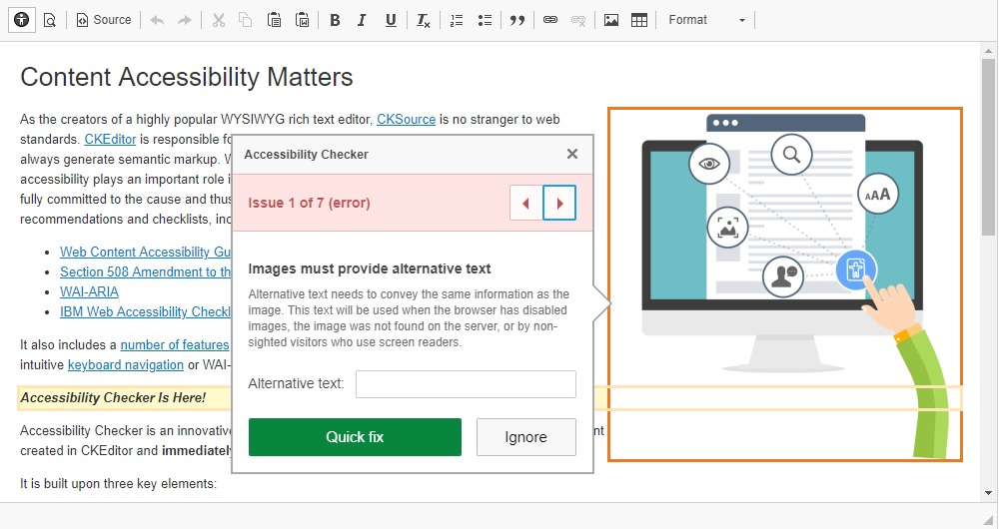

<a href="https://doc.jahiacommunity.org">
    
</a>

CKEditor WCAG extension - <a href="README.en.md">English version</a>
======================
Internet est un moyen essentiel d'accéder et de fournir des informations et des services. L'accessibilité du Web permet à chacun, y compris aux personnes handicapées, de percevoir, de comprendre, de naviguer et d'interagir avec Internet. La même vision de l'accessibilité doit s'appliquer aux applications mobiles, compte tenu des développements technologiques et des tendances au cours des dernières années. 

## La directive d'Accessibilité du Web
<a href="https://eur-lex.europa.eu/eli/dir/2016/2102/oj">Directive (EU) 2016/2102</a>, en vigueur depuis le 22 décembre 2016, offrira aux personnes handicapées un meilleur accès aux sites Web et aux applications mobiles des services publics.

## CMS : Edition de contenu
Lors de l'édition du contenu, les contributeurs ne se concentrent pas sur l'accessibilité. Pour aider les utilisateurs à répondre à la directive européenne, un plugin CKEditor peut contribuer à cet objectif. 
Le <a href="https://ckeditor.com/ckeditor-4/accessibility-checker/"> Accessibility Checker </a> fournit plusieurs règles pour contrôler la conformité du contenu à l'accessibilité du Web. Dans certains cas, un "Quickfix" est même disponible.

Pour configurer un plugin en mode édition, nous devons fournir un fichier *** config.js ***. Ce fichier de configuration contiendra une liste de plugins à activer et la position des nouvelles icônes dans les barres d'outils.

```javascript
CKEDITOR.editorConfig = function( config ) {
    config.extraPlugins='a11ychecker';
    config.toolbar_Full[8]=['Image','Flash','Table','HorizontalRule','Smiley','SpecialChar','PageBreak','A11ychecker'];
}
```
- *config.extraPlugins* = Liste des plugins à activer (ex: a11ychecker)
- *config.toolbar_Full* = Toolbar disponible avec l'ensemble des options pour les "power user"
- *config.toolbar_Basic* = Toolbar disponible avec les options basiques pour les utilisateurs avancés
- *config.toolbar_Mini* = Toolbar disponible avec un minimum d'options pour la majorité des utilisateurs
- *config.toolbar_Light* = Toolbar disponible avec uniquement les options essentielles
- *config.toolbar_User* = Toolbar disponible avec des options restreintes
- *[d]* = La position du fragment de la barre d'outils

Dans notre cas, nous plaçons la nouvelle icône à la fin en ajoutant la référence du plugin (ex: A11ychecker)

Les barres d'outils par défaut sont fournis dans les profiles originaux du CKEditor.

## Déploiement de la configuration sur les profiles CKEditor globaux
Comme vous le savez certainement, sur la plateforme CMS Jahia, les fichiers sont des ressources fournies dans les "OSGi bundles" et montés comme s'il s'agissait de ressources statiques.
Aussi pour déployer cette configuration, nous devons donc fournir un nouveau "bundle". 
Pour être configuré globalement, ce nouveau module sera même un fragment du bundle "Jahia CKEditor". 
En d'autres mots, nous allons faire le montage de fichier comme s'ils étaient directement inclus dans le bundle hôte.

### Création d'un nouveau bundle
Comme n'importe quel bundle pour Jahia, nous pouvons utiliser l'archetype maven "Jahia Module" pour créer ce nouveau bundle.

    mvn archetype:generate -DarchetypeGroupId=org.jahia.archetypes -DarchetypeArtifactId=jahia-module-archetype

ou

    mvn archetype:generate -Dfilter=org.jahia.archetypes:

Dans cette seconde commande, vous choisirez *jahia-module-archetype*.

Vous pouvez encoder les paramètres requis ou accepter les valeurs par défaut pour finaliser l'opération. 
Vous obtenez alors la structure par défaut de tous modules Jahia ainsi que sa configuration POM initiale.
Comme nous allons juste créer un fragment, nous pouvons supprimer le répertoire suivant ***\src\main\resources***

### Definir le bundle comme un fragment
La majeur partie du "truc" réside dans la section *build* du *pom.xml* 
``` xml
    <build>
        <plugins>
            <plugin>
                <groupId>org.apache.felix</groupId>
                <artifactId>maven-bundle-plugin</artifactId>
                <extensions>true</extensions>
                <configuration>
                    <instructions>
                        <Jahia-Depends>default</Jahia-Depends>
                    </instructions>
                </configuration>
            </plugin>
        </plugins>
    </build>
```
va devenir
``` xml
    <build>
        <plugins>
            <plugin>
                <groupId>org.apache.felix</groupId>
                <artifactId>maven-bundle-plugin</artifactId>
                <extensions>true</extensions>
                <configuration>
                    <instructions>
                        <!-- Defining HOST of this fragment -->
                        <Fragment-Host>ckeditor</Fragment-Host!>
                        <!-- Removing unecessary header entries -->    
                        <_removeheaders>${jahia.modules.bundle.removeheaders},
                            Jahia-Static-Resources,
                            Jahia-Depends,
                            Bundle-Category,
                            Jahia-Module-Type,
                            Jahia-Source-Control-DeveloperConnection,
                            Jahia-Source-Control-Connection,
                            Jahia-GroupId,
                            Jahia-Required-Version,
                            Jahia-Source-Folders,
                            Jahia-Source-Control-Tag,
                            Jahia-Download-Sources-Available,
                            Archiver-Version,
                            Specification-Vendor,
                            Require-Capability,
                            Implementation-*,
                            Specification*,
                            Dynamic-ImportPackage,
                            Bundle-DocURL,
                            Provide-Capability,
                            Tool,
                            Created-By,
                            Built-By,
                            Build-Jdk,
                            Import-Package
                        </_removeheaders>
                    </instructions>
                </configuration>
            </plugin>
        </plugins>
    </build>
```
### Ajout du plugin désiré
Par défaut, plusieurs plugins sont déjà fournis par le bundle "Jahia CKEditor".
Les plugins sont stocké dans le répertoie *"javscript/plugins"*. Ce répertoire se siture en dessous de *"/src/main/resources"*.
Dans notre cas, nous téléchargeons le plugin attendu au format ZIP (ex : https://download.ckeditor.com/a11ychecker/releases/a11ychecker_1.1.1.zip) et nous le décompression dans le répertoire *a11ychecker*.

Nous obtenons alors la structure suivante :

    /src
        /main
            /resources
                /javascript
                    /plugins
                        /a11ychecker
                            /icons
                            /lang
                            /libs
                            /quickfix
                            /skins
                            CHANGES.md
                            LICENSE.md
                            plugin.js
                            README.md

N'oubliez pas d'ajouter, si nécessaire, les plugin requis et complémentaires comme décrits sur la page du plugin.

### Ajout de la configuration du plugin
Comme déjà expliqué ci-dessus, pour configurer le plugin dans le mode édition, nous devons fournir un fichier ***config.js***. 
Ce fichier doit se trouver, par convention, dans */src/main/resources/javascript*.

```javascript
CKEDITOR.editorConfig = function( config ) {
    config.extraPlugins='a11ychecker';
    config.toolbar_Full[8]=['Image','Flash','Table','HorizontalRule','Smiley','SpecialChar','PageBreak','A11ychecker'];
}
```

### Construction du fragment de bundle
Comme tous les projets maven avec Jahia, le processus de construction s'effectue au moyen de la commande suivante :

    mvn clean install

Nous obtenons ainsi un bundle prêt à être déployé : *ckeditor-extension.jar*.

### Activation de l'option sur une instance Jahia
Le déploiement d'un bundle s'effectue en déposant le fichier dans le répertoire "modules" ou en passant par l'interface d'administration du serveur. 

> C'est tout ... pour le moment.

## Utilisation du plugin dans le CKEditor



Notez l'icône  qui déclenche la vérification du contenu.


